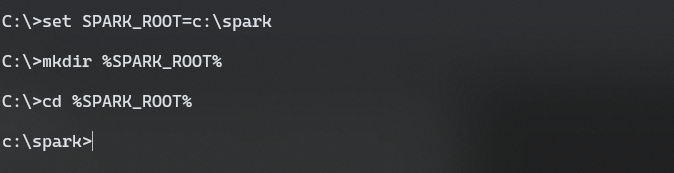
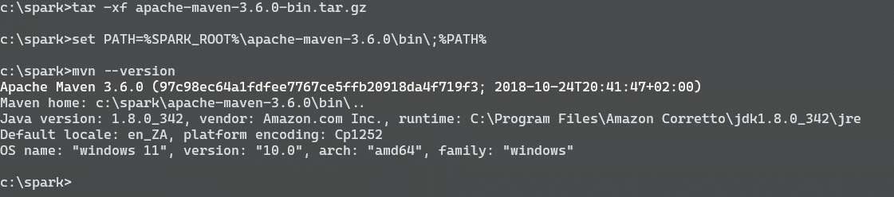
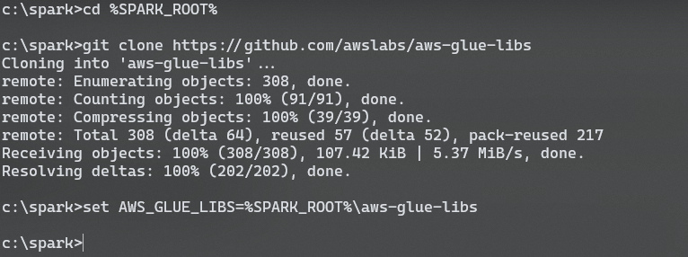
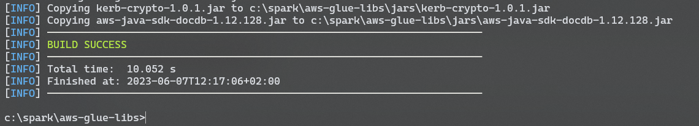
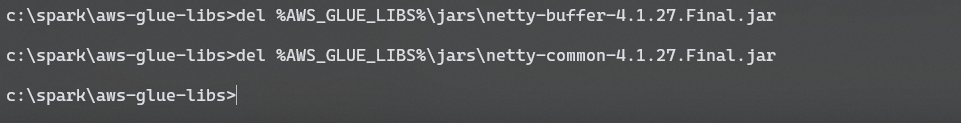
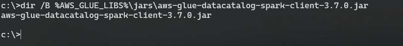
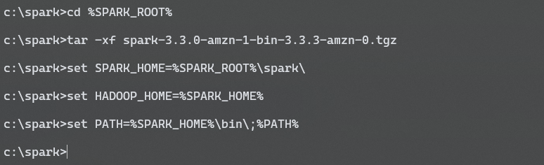
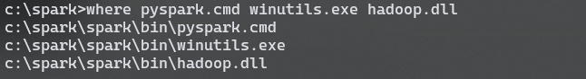
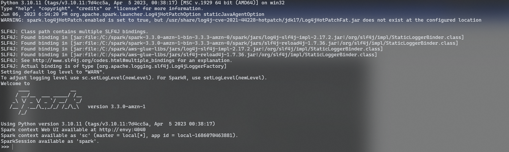

# Setup Local Glue Development Environment

This guide is roughly based on the official [AWS documentation](https://docs.aws.amazon.com/glue/latest/dg/aws-glue-programming-etl-libraries.html#develop-using-etl-library) for local Python development. Note that the official guide mainly targets developers using Linux or macOS, but there are a few additional steps required to get the environment ready for developing on a Windows machine. As such, this guide will focus on Windows specific terminology and syntax. Commands provided are written to work in `cmd.exe`.

## Install Required Software

### Git

Download and install the latest version of Git for your platform - [Downloading Windows Package (git-scm.com)](https://git-scm.com/download/win)

### Python 3.10

AWS Glue 4.0 containers run on Python 3.10, so you need to download and install the latest version of Python for your platform (download from here [Download Python | Python.org](https://www.python.org/downloads/)). Alternatively, you can use your local package manager to install the latest version of Python 3.10.x. If you are configuring your environment for an older version of AWS Glue (e.g. 1.0, 2.0 or 3.0), you will need to find and install the latest version of Python 3.7 for your platform. Note that you will probably need to compile the binaries yourself, but that is out of scope for this document.

### Java 8

The spark runtime requires Java 8 to run correctly, so you can install any compatible JDK (e.g. OpenJDK, Amazon Coretto, Oracle, etc.). This guide has been tested with Amazon Coretto 8. Follow instructions [here](https://docs.aws.amazon.com/corretto/latest/corretto-8-ug/windows-7-install.html) to install.

## Download and Configure Required Libraries

### First Steps

Start off by creating a folder called spark in your local `C:` drive. This folder will be referred to as `SPARK_ROOT` throughout the guide and will be used for all storing all files, configurations and extracted files. To do so, open a `cmd.exe` window and type the code below. Remeber to keep this window open throughout the rest of this guide.

```cmd
set SPARK_ROOT=c:\spark
mkdir %SPARK_ROOT%
cd %SPARK_ROOT%
```



### Apache Maven

Next, we are going to download Apache Maven as per the [official guide](https://aws-glue-etl-artifacts.s3.amazonaws.com/glue-common/apache-maven-3.6.0-bin.tar.gz). Make sure to save the downloaded file to your `SPARK_ROOT` directory (`c:\spark\`). Run the below to extract the file and update your `%PATH%` variable to make the `mvn` command available on your system path.

```cmd
cd %SPARK_ROOT%
tar -xf apache-maven-3.6.0-bin.tar.gz
set PATH=%SPARK_ROOT%\apache-maven-3.6.0\bin\;%PATH%
mvn --version
```



### AWS Glue libraries

#### Clone the official git repository

Now we are going to clone the AWS Glue repository and checkout the appropriate branch (the master branch defaults to the latest version of Glue -- 4.0 at the time of writing). We will then add this location to an environment variable called `AWS_GLUE_LIBS`

```cmd
cd %SPARK_ROOT%
git clone https://github.com/awslabs/aws-glue-libs
set AWS_GLUE_LIBS=%SPARK_ROOT%\aws-glue-libs
```



#### Download the required dependencies

Once the AWS Glue libraries are checked-out, we need to use Maven to download all the JAR files required by the Glue environment. This may take a while depending on your internet connection speed. To run the process using multiple threads, append -T 8 at the end of the command, replacing 8 with the number of CPU cores you want the process to use.

```cmd
cd %AWS_GLUE_LIBS%
mvn -f pom.xml -DoutputDirectory=jars dependency:copy-dependencies
```



#### Remove conflicting dependencies

After Maven has completed downloading the required JAR files, we need to manually delete some of them that will cause a conflict with those that will be downloaded as part of the Apache Spark step.

```cmd
del %AWS_GLUE_LIBS%\jars\netty-buffer-4.1.27.Final.jar
del %AWS_GLUE_LIBS%\jars\netty-common-4.1.27.Final.jar
```



#### Manually download missing Glue dependencies

There is an additional dependency required for your environment to connect the Glue data catalog. You can download a pre-compiled version of the required file from [here](bin/aws-glue-datacatalog-spark-client-3.7.0.jar). Once downloaded, place the file in the `jars` folder in `AWS_GLUE_LIBS`. Run the command below to verify the file is available in the required location. For more information, see the [official github repo](https://github.com/awslabs/aws-glue-data-catalog-client-for-apache-hive-metastore).

```cmd
dir /B %AWS_GLUE_LIBS%\jars\aws-glue-datacatalog-spark-client-3.7.0.jar
```



### Apache Spark

#### Download the required libraries

Download the Apache Spark libraries from the official AWS Glue guide. Select the version which matches the version of Glue you are building your environment for. For Glue 4.0, download [this file](https://aws-glue-etl-artifacts.s3.amazonaws.com/glue-4.0/spark-3.3.0-amzn-1-bin-3.3.3-amzn-0.tgz). Make sure to save the downloaded file to your `SPARK_ROOT` directory (`c:\spark\`). Run the below to extract the downloaded file and update your `%PATH%` variable to make the spark commands available on your system path.

```cmd
cd %SPARK_ROOT%
tar -xf spark-3.3.0-amzn-1-bin-3.3.3-amzn-0.tgz
set SPARK_HOME=%SPARK_ROOT%\spark
set HADOOP_HOME=%SPARK_HOME%
set PATH=%SPARK_HOME%\bin;%PATH%
```



#### Manually download missing Spark dependencies

Hadoop requires some additional files to in order to run on Windows. Download the files [winutils.exe](https://github.com/steveloughran/winutils/blob/master/hadoop-3.0.0/bin/winutils.exe) and [hadoop.dll](https://github.com/steveloughran/winutils/blob/master/hadoop-3.0.0/bin/hadoop.dll) and save them to the `bin` folder in `SPARK_HOME`. The files linked on this page are compatible with the Spark 3.3.0 libraries used in Glue 4.0. For older versions of Spark, you will need to download the appropriate files from [here](https://github.com/steveloughran/winutils).

Check that all files can be found and are in the correct location (`c:\spark\spark\bin\`)

```cmd
where pyspark.cmd winutils.exe hadoop.dll
```



### Configuration

#### Configure spark default settings file

Create a folder called `conf` within your `SPARK_HOME` directory (if it doesn't already exist). Create a new text file called `spark-defaults.conf` inside this `conf` directory.

```cmd
mkdir %SPARK_HOME%\conf
```

Add the following lines to the newly created `spark-defaults.conf` file, replacing the paths with the actual paths of the AWS Glue and Apache Spark libraries you just downloaded on your machine. Note that the path needs to be separated with forward-slashes (even on Windows) otherwise the Spark runtime won't be able to load the JAR files from the directory, resulting in a runtime error similar to the following: `TypeError: 'JavaPackage' object is not callable`. Also note that if multiple class paths are specified, then you need to separate each path with the correct character for your platform. This means using a semicolon (;)on Windows, and a regular colon (:) on Linux/macOS. The configuration provided below is for a Windows system.

```text
spark.executor.extraClassPath C:/spark/spark/jars/*;C:/spark/aws-glue-libs/jars/*
spark.driver.extraClassPath C:/spark/spark/jars/*;C:/spark/aws-glue-libs/jars/*
spark.sql.catalogImplementation hive
spark.hadoop.mapreduce.fileoutputcommitter.algorithm.version    2
spark.hadoop.mapreduce.fileoutputcommitter.marksuccessfuljobs   false
spark.unsafe.sorter.spill.read.ahead.enabled    false
spark.network.crypto.enabled    true
spark.network.crypto.keyLength  256
spark.network.crypto.keyFactoryAlgorithm    PBKDF2WithHmacSHA256
spark.network.crypto.saslFallback   false
# Disabling I/O encryption to avoid running into SPARK-34790 (Refer discussion in https://github.com/awslabs/aws-glue-libs/issues/128)
spark.io.encryption.enabled false
spark.authenticate  true
```

#### Create hive configuration files

Create a file called `hive-site.xml` in the conf directory in your `SPARK_HOME` folder and add the following lines

```xml
<configuration>
   <property>
       <name>hive.metastore.connect.retries</name>
       <value>15</value>
   </property>
   <property>
       <name>hive.metastore.client.factory.class</name>
       <value>com.amazonaws.glue.catalog.metastore.AWSGlueDataCatalogHiveClientFactory</value>
   </property>
</configuration>
```

Create another file called core-site.xml in the conf directory and add the following lines

```xml
<configuration>
    <property>
        <name>fs.s3.impl</name>
        <value>org.apache.hadoop.fs.s3a.S3AFileSystem</value>
    </property>
    <property>
        <name>fs.s3a.impl</name>
        <value>org.apache.hadoop.fs.s3a.S3AFileSystem</value>
    </property>
    <property>
        <name>fs.s3a.aws.credentials.provider</name>
        <value>com.amazonaws.auth.DefaultAWSCredentialsProviderChain</value>
    </property>
    <property>
        <name>fs.s3.aws.credentials.provider</name>
        <value>com.amazonaws.auth.DefaultAWSCredentialsProviderChain</value>
    </property>
</configuration>
```

Create one last file in the conf directory and call it `log4j2.properties`, adding the following lines

```text
#
# Licensed to the Apache Software Foundation (ASF) under one or more
# contributor license agreements.  See the NOTICE file distributed with
# this work for additional information regarding copyright ownership.
# The ASF licenses this file to You under the Apache License, Version 2.0
# (the "License"); you may not use this file except in compliance with
# the License.  You may obtain a copy of the License at
#
#    http://www.apache.org/licenses/LICENSE-2.0
#
# Unless required by applicable law or agreed to in writing, software
# distributed under the License is distributed on an "AS IS" BASIS,
# WITHOUT WARRANTIES OR CONDITIONS OF ANY KIND, either express or implied.
# See the License for the specific language governing permissions and
# limitations under the License.
#

# Set everything to be logged to the console
rootLogger.level = info
rootLogger.appenderRef.stdout.ref = console

# In the pattern layout configuration below, we specify an explicit `%ex` conversion
# pattern for logging Throwables. If this was omitted, then (by default) Log4J would
# implicitly add an `%xEx` conversion pattern which logs stacktraces with additional
# class packaging information. That extra information can sometimes add a substantial
# performance overhead, so we disable it in our default logging config.
# For more information, see SPARK-39361.
appender.console.type = Console
appender.console.name = console
appender.console.target = SYSTEM_ERR
appender.console.layout.type = PatternLayout
appender.console.layout.pattern = %d{yy/MM/dd HH:mm:ss} %p %c{1}: %m%n%ex

# Set the default spark-shell/spark-sql log level to WARN. When running the
# spark-shell/spark-sql, the log level for these classes is used to overwrite
# the root logger's log level, so that the user can have different defaults
# for the shell and regular Spark apps.
logger.repl.name = org.apache.spark.repl.Main
logger.repl.level = warn

logger.thriftserver.name = org.apache.spark.sql.hive.thriftserver.SparkSQLCLIDriver
logger.thriftserver.level = warn

# Settings to quiet third party logs that are too verbose
logger.jetty1.name = org.sparkproject.jetty
logger.jetty1.level = warn
logger.jetty2.name = org.sparkproject.jetty.util.component.AbstractLifeCycle
logger.jetty2.level = error
logger.replexprTyper.name = org.apache.spark.repl.SparkIMain$exprTyper
logger.replexprTyper.level = info
logger.replSparkILoopInterpreter.name = org.apache.spark.repl.SparkILoop$SparkILoopInterpreter
logger.replSparkILoopInterpreter.level = info
logger.parquet1.name = org.apache.parquet
logger.parquet1.level = error
logger.parquet2.name = parquet
logger.parquet2.level = error

# SPARK-9183: Settings to avoid annoying messages when looking up nonexistent UDFs in SparkSQL with Hive support
logger.RetryingHMSHandler.name = org.apache.hadoop.hive.metastore.RetryingHMSHandler
logger.RetryingHMSHandler.level = fatal
logger.FunctionRegistry.name = org.apache.hadoop.hive.ql.exec.FunctionRegistry
logger.FunctionRegistry.level = error

# For deploying Spark ThriftServer
# SPARK-34128: Suppress undesirable TTransportException warnings involved in THRIFT-4805
appender.console.filter.1.type = RegexFilter
appender.console.filter.1.regex = .*Thrift error occurred during processing of message.*
appender.console.filter.1.onMatch = deny
appender.console.filter.1.onMismatch = neutral


# HADOOP-14596: Suppress "S3AbortableInputStream" WARN messages.
logger.S3AbortableInputStream.name = com.amazonaws.services.s3.internal.S3AbortableInputStream
```

### Test Your Environment

Congratulations! You've made it to the end, now it's time to test your setup and make sure everything is working as expected.

First of all, you need to login to AWS using the AWS CLI.

Then, run the `pyspark` executable from your `SPARK_HOME\bin` directory

```cmd
set PYTHONPATH=%SPARK_HOME%\python\lib\pyspark.zip;%SPARK_HOME%\python\lib\py4j-0.10.9.5-src.zip;%AWS_GLUE_LIBS%;%PYTHONPATH%
%SPARK_HOME%\bin\pyspark
```

You should see output similar to the below.


Note that you may get the following error: `WARN ProcfsMetricsGetter: Exception when trying to compute pagesize, as a result reporting of ProcessTree metrics is stopped`, which you can safely ignore. This should only appear when you first start a PySpark session.

Finally, run the below python code and observe the output, remembering to replace `YOUR_S3_BUCKET_NAME` with an s3 bucket that you have access to.

```python
from awsglue.context import GlueContext
import socket
import uuid

glue_context = GlueContext(sc)
s3_bucket = "YOUR_S3_BUCKET_NAME"
test_s3_path = f"s3://{s3_bucket}/pyspark_test/{socket.gethostname()}/{str(uuid.uuid4())}"
glue_context.sql("SHOW DATABASES").coalesce(1).write.parquet(path=test_s3_path, mode="overwrite")
glue_context.read.parquet(test_s3_path).show(truncate=False)
```

If you see something similar to the below, you have successfully configured your local Glue environment and can now read from, and write to, S3 and the AWS Glue catalog!


### Wrapping Up

If you managed to successfully run the PySpark test above, you should update the environment variables for your user account so that you can access PySpark anytime. To do so, run the below commands which will ensure that the environment variables are persisted to the Windows registy.

```cmd
set SPARK_ROOT=c:\spark
setx AWS_GLUE_LIBS %SPARK_ROOT%\aws-glue-libs
setx SPARK_HOME %SPARK_ROOT%\spark
setx HADOOP_HOME %SPARK_ROOT%\spark
setx PYTHONPATH "%SPARK_ROOT%\spark\python\lib\pyspark.zip;%SPARK_ROOT%\spark\python\lib\py4j-0.10.9.5-src.zip;%SPARK_ROOT%\aws-glue-libs;%PYTHONPATH%"
for /F "Skip=2Tokens=1-2*" %A In ('Reg Query HKCU\Environment /V PATH 2^>Nul') do @set USERPATH=%C
setx PATH "%SPARK_ROOT%\spark\bin;%USERPATH%"
```
